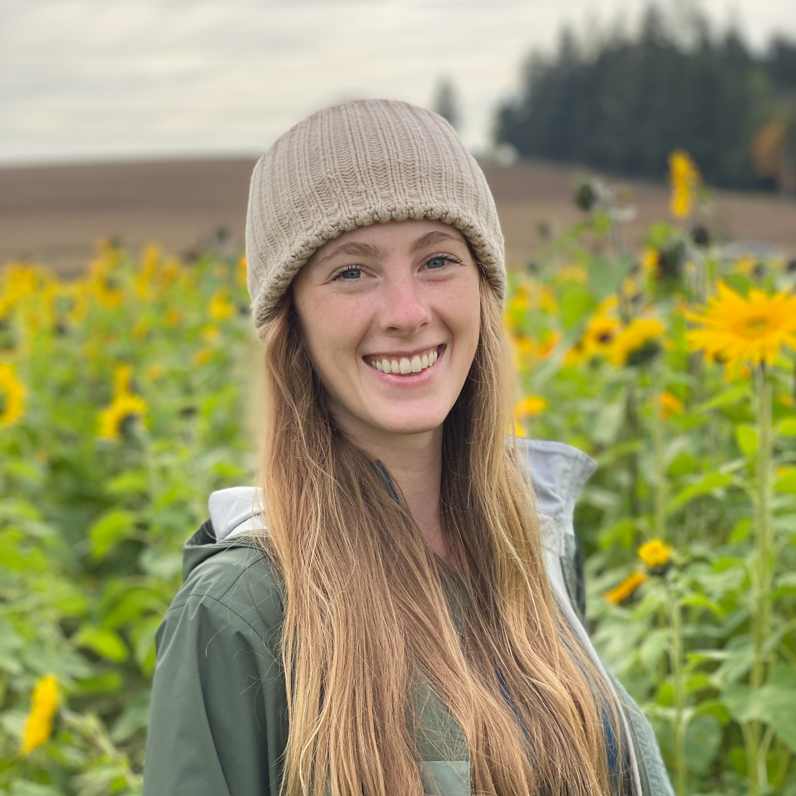

# **Termagotchi**

## **Description:**

A terminal based, Tamagotchi inspired, choose your own adventure story. The choices you make will determine whether or not your Termagotchi will stay with you or run away. Choose wisely! (Works best on a Mac)

    terminal command: npx the-termagotchi

## **About the project:**

This project was developed in a one week sprint using express and inquirer. Inquirer is the command line interface that users see. Express is used to create the database which stores the players username and password. It also stores the actions/prompts, and directs the player down the correct path based on their choice.

## **About the Developers:**

### | [**Jenna Graham**](https://www.linkedin.com/in/jenna-lee-graham/) |  

 

Jenna is a Software Developer based in Portland, Oregon. When she is not in front of the computer screen she enjoys yoga, photography and teaches a dance called Kizomba. She has one pet: Redd.

### | [**Jessica Martin**](https://www.linkedin.com/in/jessica-martin5564/) | 

Jessica is a Full Stack Software Developer in Corvallis, Oregon. Previously a botanist, she still enjoys going on hikes and foraging for mushrooms in her free time. She has four pets: Ghoul, Momo, Stu, and Ožujsko.

### | [**Colter Garrison**](https://www.linkedin.com/in/colter-garrison/) | 

Colter is a Full Stack Software Developer in Corvallis, Oregon. Outside of coding, he enjoys biking and skiing. He has four pets: Momo, Stu, Ghoul, and Ožujsko.

### | [**Mariah Schock**](https://www.linkedin.com/in/mariah-schock/) | 

Mariah is a Full Stack Software Developer in Sherwood, Oregon. Previously in healthcare, in 2022, she decided to pursue a career in software development. Outside of coding, she enjoys hiking and paddle-boarding. She has three pets: Leo, TK (Thicc Kitty), and Phoebe.
